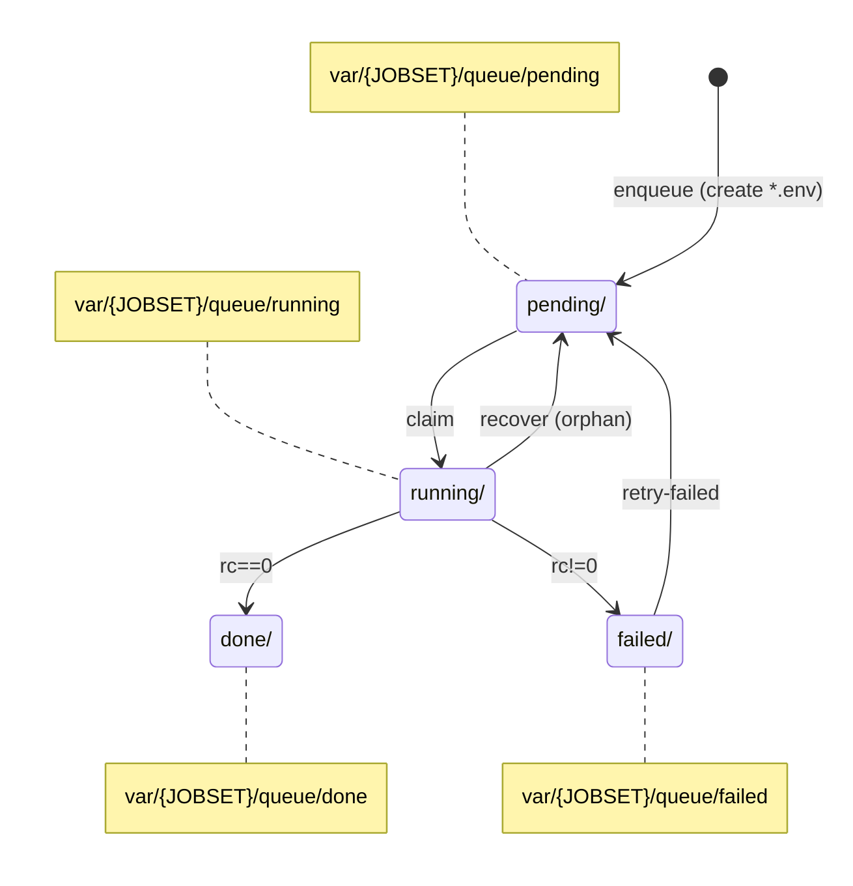

# sagequeue

`sagequeue` runs long SageMath experiments inside a **rootless Podman** container on **Ubuntu (WSL2)** using **podman-compose**, and executes partitions of the workload via a **durable on-disk queue** with workers supervised by **systemd --user**.

Primary target workload: stride/offset partitioned runs of `rank_boundary_sat_v18.sage` (e.g. `STRIDE=8`, offsets `0..7`) for mod-2 boundary rank distribution experiments (e.g. Shrikhande graph, then rook graph).

## Repository layout

Top-level:

- `Containerfile` — builds the local Sage image used by `podman-compose.yml` (includes `pycryptosat` for CryptoMiniSat).
- `podman-compose.yml` — runs the `sagemath` container and exposes Jupyter on port 8888.
- `Makefile` — jobset selection, queue operations, and systemd `--user` service control.
- `config/*.mk` — jobset configs (Shrikhande and rook live here).
- `systemd/` — user unit files installed into `~/.config/systemd/user/`.
- `var/` — durable queue + logs (gitignored).
- `man-up.sh`, `man-down.sh`, `run-bash.sh` — container convenience helpers.
- `venvfix.sh`, `requirements.txt` — repo-local `.venv` with `podman-compose` (so `systemd --user` can find it).

`bin/`:

- `bin/build-image.sh` — builds the local image defined by `Containerfile` and recreates the `sagemath` container.
- `bin/setup.sh` — idempotent setup (bind mounts, permissions, venv/podman-compose visibility, optional linger).
- `bin/sagequeue-diag.sh` — one-shot diagnostic snapshot (queue + systemd + container + solver procs).
- `bin/sagequeue-ensure-container.sh` — oneshot “ensure container is up” (used by systemd unit `sagequeue-container.service`).
- `bin/sagequeue-worker.sh` — worker loop (used by `sagequeue@.service`).
- `bin/sagequeue-recover.sh` — requeues orphaned `running/` jobs (used by `sagequeue-recover.service`).
- `bin/fix-bind-mounts.sh`, `bin/show-mapped-ids.sh` — rootless bind-mount permission helpers.

## Container + notebooks

**Notebook location:** `rank_boundary_sat_v18.sage` is expected to exist on the host at:

- Linux/WSL path: `${HOME}/Jupyter/rank_boundary_sat_v18.sage`
- Windows path (same directory): `~\Jupyter\rank_boundary_sat_v18.sage`

That directory is bind-mounted as:

- container path: `/home/sage/notebooks/rank_boundary_sat_v18.sage`

The experiment uses `--resume`, so state files (e.g. `state_shrikhande_r3_stride8_off0.txt`) live alongside the notebook in `${HOME}/Jupyter/` and survive reboots and container recreation.

## Why a custom image exists (CryptoMiniSat backend)

The default configs use:

- `--solver sat --sat_backend cryptominisat`

Sage’s `cryptominisat` backend requires `pycryptosat` inside Sage’s Python environment. Installing it manually in a running container works, but it is lost whenever the container is removed and recreated (e.g. `podman-compose down`).

This repository bakes `pycryptosat` into the image via `Containerfile`. The local image tag is:

- `localhost/sagequeue-sagemath:10.7-pycryptosat` (for `SAGE_TAG=10.7`)

## Installation

### 0) Enable systemd in WSL2

Edit `/etc/wsl.conf` (merge with existing sections; do not delete them):

```ini
[boot]
systemd=true
```

From **Windows PowerShell**:

```powershell
wsl.exe --shutdown
```

Re-open Ubuntu and confirm:

```bash
ps -p 1 -o comm=
podman ps
systemctl --user status >/dev/null
```

### 1) Create the virtual environment in the repository root

```bash
chmod +x venvfix.sh bin/setup.sh bin/build-image.sh
./venvfix.sh
```

### 2) Run the idempotent local setup

```bash
chmod +x bin/setup.sh
bin/setup.sh
```

This script creates the bind-mount directories (using `.sagequeue-*` names), fixes permissions/ACLs for rootless Podman bind mounts, ensures `podman-compose` exists (via repo-local `.venv`), and (optionally) enables linger so `systemd --user` services can run after reboot without an interactive login.

### 3) Build the local Sage image and recreate the container

From the repo root:

```bash
chmod +x bin/build-image.sh
bin/build-image.sh
```

What this does (by design):

- builds `localhost/sagequeue-sagemath:${SAGE_TAG}-pycryptosat` from `Containerfile` (default `SAGE_TAG=10.7`)
- removes any existing `sagemath` container
- runs `podman-compose up -d sagemath` to start a fresh container from the new image

**Important constraint:** `SAGE_TAG` is the *base Sage version* (e.g. `10.7`). Do not include `-pycryptosat` in `SAGE_TAG`.

### 4) Enable the queue services for a jobset

Shrikhande rank-3 jobset:

```bash
chmod +x bin/*.sh
make CONFIG=config/shrikhande_r3.mk enable
```

This:

- writes `~/.config/sagequeue/sagequeue.env` for the selected jobset
- installs user unit files into `~/.config/systemd/user/`
- enables and starts:
  - `sagequeue-container.service`
  - `sagequeue-recover.timer`
  - `sagequeue@1.service` … `sagequeue@WORKERS.service`

### 5) Enqueue stride offsets

```bash
make CONFIG=config/shrikhande_r3.mk enqueue-stride
```

### 6) Monitor

```bash
make CONFIG=config/shrikhande_r3.mk progress
make CONFIG=config/shrikhande_r3.mk logs
```

A full snapshot:

```bash
make CONFIG=config/shrikhande_r3.mk diag
```

Logs land in:

- `var/shri_r3/log/shri_r3_off0.log`
- …
- `var/shri_r3/log/shri_r3_off7.log`

## How jobsets work (config/*.mk)

A jobset config sets (at minimum):

- `JOBSET` — directory prefix under `var/`
- `STRIDE` — number of offsets
- `WORKERS` — number of `systemd` worker instances
- `SAGE_BASE_ARGS` — experiment flags **excluding** `--stride` and `--offset`
- stop file paths for host and container

The Makefile writes those into:

- `~/.config/sagequeue/sagequeue.env`

Systemd units source that file at runtime.

## Queue model

A **jobset** is a named experiment run (graph + rank + solver configuration + stride/worker count) with its own isolated queue and logs.  
In practice, `JOBSET` is the short identifier used to namespace runtime state under `var/` so multiple experiments do not collide.

- `JOBSET` is set by the selected `config/*.mk` file (e.g. `JOBSET=shri_r3`, `JOBSET=rook_r3`).
- Switching jobsets changes the `var/<JOBSET>/...` directories and the log prefix, but the worker logic is unchanged.

Example: with `JOBSET=shri_r3`, queue state lives under `var/shri_r3/queue/...` and logs under `var/shri_r3/log/`.


On-disk layout per jobset:

- `var/<JOBSET>/queue/pending/`
- `var/<JOBSET>/queue/running/`
- `var/<JOBSET>/queue/done/`
- `var/<JOBSET>/queue/failed/`
- `var/<JOBSET>/log/`
- `var/<JOBSET>/run/`


### Queue state machine

Each job is a tiny env file (currently `OFFSET=<k>`). Workers:

1. claim a job by atomic move `pending → running`
2. execute Sage inside the container with:
   - configured `SAGE_BASE_ARGS`
   - plus injected `--stride STRIDE --offset OFFSET`
3. move the job file to `done/` or `failed/`


The job’s **state** is defined by which directory contains that file:

* `pending/` — eligible to be claimed by a worker
* `running/` — claimed by a worker (ownership metadata stored in `*.owner`)
* `done/` — completed successfully (solver exit code 0)
* `failed/` — completed unsuccessfully (solver exit code nonzero) or malformed job file

State transitions are implemented as filesystem moves (`mv`) within the same jobset directory tree, so claiming work is an atomic `pending → running` move.



**Transition meanings (what actually happens on disk):**

- **enqueue (create `*.env`)**  
  `make … enqueue-stride` writes one job file per offset into `var/{JOBSET}/queue/pending/`, e.g. `shri_r3_off7.env` containing at least `OFFSET=7` (and `ENQUEUED_AT=...`).

- **claim (`pending → running`)**  
  A worker claims work by an atomic rename:  
  `mv var/{JOBSET}/queue/pending/<job>.env  var/{JOBSET}/queue/running/<job>.env`  
  It then writes an owner sidecar file:  
  `var/{JOBSET}/queue/running/<job>.env.owner` containing:
  - `OWNER_PID=$$` (host PID of the worker process)
  - `OWNER_WORKER_ID=<N>`
  - `OWNER_TS=<timestamp>`

- **rc==0 (`running → done`)**  
  After `podman exec … ./sage …` exits with status 0, the worker moves:  
  `mv …/running/<job>.env  …/done/<job>.env`

- **rc!=0 (`running → failed`)**  
  If Sage exits nonzero (including configuration errors detected by the worker after sourcing the job file), the worker moves:  
  `mv …/running/<job>.env  …/failed/<job>.env`

- **retry-failed (`failed → pending`)**  
  `make … retry-failed` moves every `*.env` file from `failed/` back to `pending/` so workers will rerun them.

- **recover (orphan) (`running → pending`)**  
  Recovery scans `running/*.env` and treats a job as orphaned if its `*.owner` file is missing, cannot be sourced, the recorded `OWNER_PID` is not alive (`kill -0` fails), or that PID is alive but is no longer a `sagequeue-worker.sh` process.  
  For each orphaned job, recovery removes any stale `*.owner` and moves:  
  `mv …/running/<job>.env  …/pending/<job>.env`  
  Recovery is guarded by a global `flock` on `var/{JOBSET}/run/recover.lock` so it is safe to run from multiple workers and from the systemd timer.


### Recovery semantics (what “orphaned running jobs” means)

A job in `running/` is considered *owned* when it has a sibling owner file:

* `running/<job>.env`
* `running/<job>.env.owner`

When a worker claims a job (`pending → running`), it writes `<job>.env.owner` containing:

* `OWNER_PID=$$` (the worker’s PID on the host)
* `OWNER_WORKER_ID=<N>`
* `OWNER_TS=<timestamp>`

The recovery script (`bin/sagequeue-recover.sh`) scans `running/*.env` and treats a job as **orphaned** if **any** of the following is true:

1. the `.owner` file is missing, or
2. the `.owner` file exists but cannot be sourced, or
3. `OWNER_PID` is missing, or
4. `kill -0 $OWNER_PID` fails (worker PID no longer exists), or
5. the PID exists but `ps -p $OWNER_PID -o args=` does not contain `sagequeue-worker.sh`
   (PID has been reused for some other process)

For each orphaned job, recovery performs the state transition:

* `running/<job>.env  →  pending/<job>.env`

and removes the stale owner file.

Concurrency control: `bin/sagequeue-recover.sh` takes a single global lock (`var/<JOBSET>/run/recover.lock`) via `flock`, so multiple workers and the systemd timer can all invoke recovery safely.

Where recovery runs:

* once at the start of every worker process (worker does a one-shot recovery before entering the main claim loop)
* periodically via `sagequeue-recover.timer` → `sagequeue-recover.service`

What recovery **does not** do: it does not inspect whether a container-side solver process is still running. Ownership is defined strictly in terms of the host worker PID recorded in the `.owner` file.


### Configuration contract

`SAGE_BASE_ARGS` must not include `--stride` or `--offset`.

- `STRIDE` comes from `config/*.mk`
- `OFFSET` comes from the queued job file
- the worker injects both

Workers exit with a configuration error if `SAGE_BASE_ARGS` contains either flag.

## systemd --user units (what they do)

Units shipped in `systemd/`:

- `sagequeue-container.service`  
  Oneshot service. Ensures the `sagemath` container exists and is running. This is a dependency of the workers.


- `sagequeue@.service`  
  Template unit. Instance `sagequeue@N.service` runs one worker loop (see “Queue model”).


- `sagequeue-recover.service`  
  Scans `running/` for jobs left behind by crashes/reboots and requeues them to `pending/`.

- `sagequeue-recover.timer`  
  Triggers `sagequeue-recover.service` periodically.

Inspect the live installed units:

```bash
systemctl --user cat sagequeue-container.service
systemctl --user cat sagequeue@.service
systemctl --user cat sagequeue-recover.timer
```

## Operational procedures (startup, stop, recovery)

### Procedure: restart everything for the active jobset

```bash
make CONFIG=config/shrikhande_r3.mk restart
```

### Procedure: stop everything for the active jobset

```bash
make CONFIG=config/shrikhande_r3.mk stop
```

### Procedure: stop-gate new work (without deleting queue state)

Creates the host stop file that is bind-mounted into the container:

```bash
make CONFIG=config/shrikhande_r3.mk request-stop
```

To resume:

```bash
make CONFIG=config/shrikhande_r3.mk clear-stop
```

### Procedure: requeue orphaned running jobs immediately

```bash
make CONFIG=config/shrikhande_r3.mk requeue-running
```

### Procedure: retry failures

```bash
make CONFIG=config/shrikhande_r3.mk retry-failed
```

### Procedure: destructive reset of the jobset queue

```bash
make CONFIG=config/shrikhande_r3.mk purge-queue
make CONFIG=config/shrikhande_r3.mk enqueue-stride
```

### Procedure: switching to rook

```bash
make CONFIG=config/rook_r3.mk env restart
make CONFIG=config/rook_r3.mk enqueue-stride
```

Queue state remains separated:

- `var/shri_r3/...`
- `var/rook_r3/...`

### Procedure: rebuild the container image without corrupting the queue

`bin/build-image.sh` removes and recreates the `sagemath` container.  
If workers are running during container removal, their in-flight `podman exec sagemath ...` 
calls fail and the corresponding job files move to `var/<JOBSET>/queue/failed/` i
(typical exit codes: `rc=137` / `rc=255`, including “container has already been removed”).

Run this sequence (example jobset: Shrikhande r=3):

```bash
# Stop new job claims, then stop all jobset services
make CONFIG=config/shrikhande_r3.mk request-stop
make CONFIG=config/shrikhande_r3.mk stop

# Rebuild image and recreate container
bin/build-image.sh

# Start services again
make CONFIG=config/shrikhande_r3.mk restart

# Requeue jobs that failed due to the rebuild
make CONFIG=config/shrikhande_r3.mk retry-failed

# Allow new job claims again
make CONFIG=config/shrikhande_r3.mk clear-stop

# Verification: confirm the running container is using the rebuilt image
podman inspect sagemath --format 'ImageName={{.ImageName}} ContainerImageID={{.Image}}'
podman image inspect localhost/sagequeue-sagemath:${SAGE_TAG:-10.7}-pycryptosat --format 'BuiltImageID={{.Id}} Tags={{.RepoTags}}'

# Verification: confirm pycryptosat is importable in the *running* container
podman exec -it sagemath bash -lc 'cd /sage && ./sage -python -c "import pycryptosat; print(pycryptosat.__version__)"'

# Verification: confirm workers are active and jobs are being claimed
systemctl --user --no-pager -l status "sagequeue@1.service"
make CONFIG=config/shrikhande_r3.mk progress
podman exec sagemath bash -lc "pgrep -af '^python3 .*rank_boundary_sat_v18\.sage\.py' | wc -l"
```

## Jupyter URL / token

Jupyter URL:

- `http://localhost:8888`

Token extraction (note `2>&1`, because Jupyter token lines may appear on stderr in `podman logs` output):

```bash
podman logs --tail 2000 sagemath 2>&1 | grep -Eo 'token=[0-9a-f]+' | tail -n 1
```

URL with token:

```bash
TOKEN="$(podman logs --tail 2000 sagemath 2>&1 | grep -Eo 'token=[0-9a-f]+' | tail -n 1)"
echo "http://localhost:8888/tree?${TOKEN}"
```

## License

MIT. See `LICENSE`.

